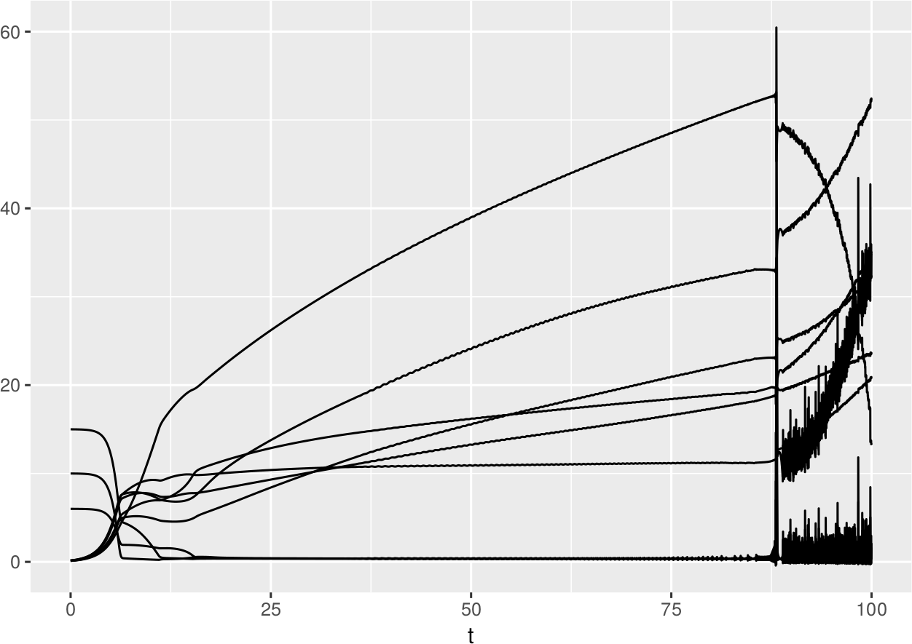

# huisman_weissing_1999

Branch||
---|---|---
master| | 
develop| | 
 
Code for Huisman, Jef, and Franz J. Weissing. "Biodiversity of plankton by species oscillations and chaos." Nature 402.6760 (1999): 407.

